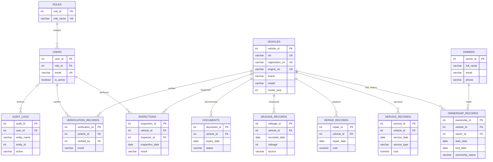

# AutoLedger Entity Relationship Diagram

```mermaid
erDiagram
    ROLES ||--o{ USERS : assigns
    USERS ||--o{ INSPECTIONS : performs
    USERS ||--o{ VERIFICATION_RECORDS : verifies
    USERS o|--o{ AUDIT_LOGS : authors
    VEHICLES ||--o{ OWNERSHIP_RECORDS : has_history
    OWNERS ||--o{ OWNERSHIP_RECORDS : holds
    VEHICLES ||--o{ SERVICE_RECORDS : serviced
    VEHICLES ||--o{ REPAIR_RECORDS : repaired
    VEHICLES ||--o{ MILEAGE_RECORDS : measured
    VEHICLES ||--o{ INSPECTIONS : inspected
    VEHICLES ||--o{ DOCUMENTS : documented
    VEHICLES ||--o{ VERIFICATION_RECORDS : verified

    ROLES {
        int role_id PK
        varchar role_name UK
    }
    USERS {
        int user_id PK
        int role_id FK
        varchar email UK
        boolean is_active
    }
    OWNERS {
        int owner_id PK
        varchar full_name
        varchar email
        varchar phone
    }
    VEHICLES {
        int vehicle_id PK
        varchar vin UK
        varchar registration_no UK
        varchar engine_no UK
        varchar brand
        varchar model
        int model_year
    }
    OWNERSHIP_RECORDS {
        int ownership_id PK
        int vehicle_id FK
        int owner_id FK
        date start_date
        date end_date
        varchar ownership_status
    }
    SERVICE_RECORDS {
        int service_id PK
        int vehicle_id FK
        date service_date
        varchar service_type
        numeric cost
    }
    REPAIR_RECORDS {
        int repair_id PK
        int vehicle_id FK
        date repair_date
        numeric cost
    }
    MILEAGE_RECORDS {
        int mileage_id PK
        int vehicle_id FK
        date recorded_date
        int mileage
        varchar source
    }
    INSPECTIONS {
        int inspection_id PK
        int vehicle_id FK
        int inspector_id FK
        date inspection_date
        varchar result
    }
    DOCUMENTS {
        int document_id PK
        int vehicle_id FK
        date expiry_date
        varchar status
    }
    VERIFICATION_RECORDS {
        int verification_id PK
        int vehicle_id FK
        int verified_by FK
        varchar result
    }
    AUDIT_LOGS {
        int audit_id PK
        int user_id FK
        varchar entity_name
        int entity_id
        varchar action
    }
```